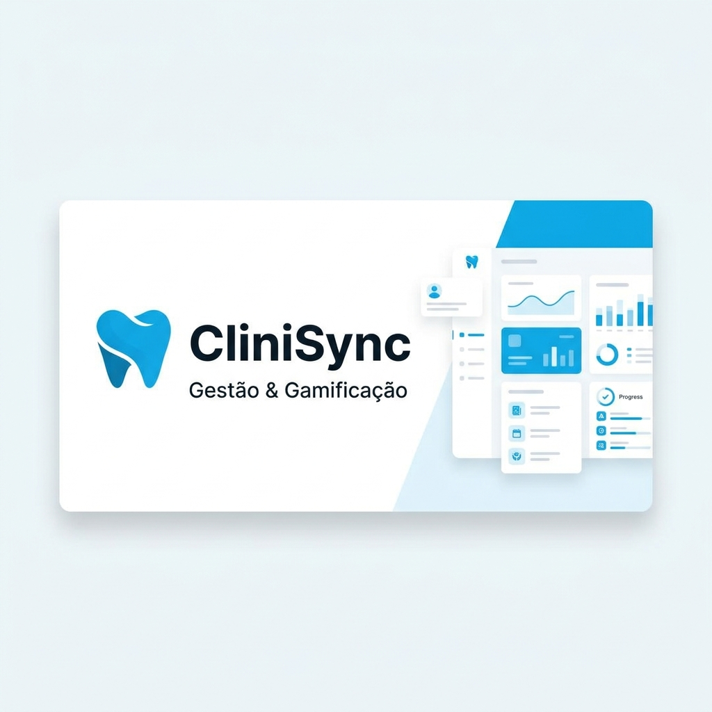

# 🦷 CliniSync — Gestão & Gamificação para Clínicas Odontológicas



## 📋 Sobre o Projeto

**CliniSync** é um sistema web de gestão para clínicas odontológicas que combina funcionalidades administrativas com **gamificação**, incentivando a assiduidade dos pacientes por meio de um sistema de pontos, níveis e recompensas.

O sistema conta com:
- **Portal do Cliente:** onde o paciente visualiza seus pontos, nível (Bronze, Prata, Ouro, Diamante), próximas consultas e resgata recompensas.
- **Painel Administrativo:** dashboard completo para gerenciar clientes, agenda, serviços, recompensas e acompanhar KPIs financeiros.

🔗 **Acesso online:** [https://clinicsync-af312.web.app](https://clinicsync-af312.web.app)

---

## 🚀 Tecnologias Utilizadas

| Tecnologia | Finalidade |
|-----------|-----------|
| **HTML5** | Estrutura semântica das páginas |
| **CSS3** | Estilização responsiva (Mobile First) |
| **JavaScript (Vanilla)** | Lógica de negócio e interatividade |
| **Firebase Hosting** | Deploy e hospedagem na nuvem |
| **Firebase Firestore** | Banco de dados NoSQL em tempo real |
| **Phosphor Icons** | Ícones vetoriais modernos |
| **Google Fonts (Outfit)** | Tipografia premium |

---

## 🎮 Sistema de Gamificação

O CliniSync utiliza mecânicas de gamificação para engajar pacientes:

- **Pontos:** +10 pontos ao comparecer a uma consulta.
- **Níveis:** Bronze (0-49pts) → Prata (50-119pts) → Ouro (120-249pts) → Diamante (250+pts)
- **Barra de Progresso:** visualização do avanço até o próximo nível.
- **Recompensas:** troca de pontos por descontos e bônus.
- **Presente de Aniversário:** desconto automático no mês do aniversário.
- **Ranking de Assiduidade:** competição saudável entre pacientes.
- **Alertas Visuais:** lembretes pulsantes para consultas hoje/amanhã.

---

## 📱 Funcionalidades

### Portal do Cliente
- Login por seleção de perfil
- Visualização de saldo de pontos e nível
- Vitrine de recompensas com resgate de cupons
- Extrato de pontos (histórico de transações)
- Listagem de próximas consultas

### Painel Administrativo
- **Dashboard:** KPIs de receita, clientes, consultas do mês e receita pendente
- **Agenda:** visualização em lista e calendário semanal, com filtros e busca
- **Clientes:** cadastro, edição, exclusão, contato via WhatsApp
- **Serviços:** gerenciamento de procedimentos e valores
- **Recompensas:** criação de benefícios com custo em pontos
- **Status de agendamento:** Pendente, Concluído, Cancelado, Reagendado

---

## 🏃 Como Rodar Localmente

### Pré-requisitos
- [Node.js](https://nodejs.org/) instalado
- [Firebase CLI](https://firebase.google.com/docs/cli) instalado (`npm install -g firebase-tools`)

### Passo a passo

```bash
# 1. Clone o repositório
git clone https://github.com/Allana-Pimentel/CliniSync.git

# 2. Acesse a pasta do projeto
cd CliniSync

# 3. Faça login no Firebase
firebase login

# 4. Inicie o servidor local
firebase serve --project clinicsync-af312

# 5. Acesse no navegador
# http://localhost:5000
```

### Credenciais de acesso (Admin)
- **Usuário:** `admin`
- **Senha:** `admin`

---

## 📂 Estrutura do Projeto

```
CliniSync/
├── public/
│   ├── index.html          # Portal do Cliente
│   ├── login.html          # Tela de Login Admin
│   ├── admin.html          # Painel Administrativo
│   ├── app.js              # Lógica do Portal do Cliente
│   ├── admin.js            # Lógica do Painel Admin
│   ├── style.css           # Estilos globais (responsivo)
│   └── og-image.png        # Imagem para Open Graph (WhatsApp)
├── firebase.json           # Configuração do Firebase Hosting
└── README.md               # Este arquivo
```

---

## ♿ Acessibilidade

- Tags `aria-label` em botões de ícone
- Labels associados a campos de formulário (`for`)
- Contraste de cores adequado
- Barra de progresso com `role="progressbar"`
- Spinner de carregamento com `role="status"`
- Tags Open Graph para preview em redes sociais

---

## 👥 Equipe

| Nome | GitHub |
|------|--------|
| Allana Pimentel | [@Allana-Pimentel](https://github.com/Allana-Pimentel) |
| Sâmya Ketully de Moraes Sotero | [@SamyaKetully](https://github.com/SamyaKetully/) |
| Lorenzo Gauto Vendrame | [@lorenzovendrame](https://github.com/lorenzovendrame) |
| Celso José de Britto Filho | [@Celsosixsix](https://github.com/Celsosixsix) |
| Julia Dias | [@jjulinha](https://github.com/jjulinha/) |


---

## 📄 Licença

Este projeto foi desenvolvido para fins acadêmicos.
